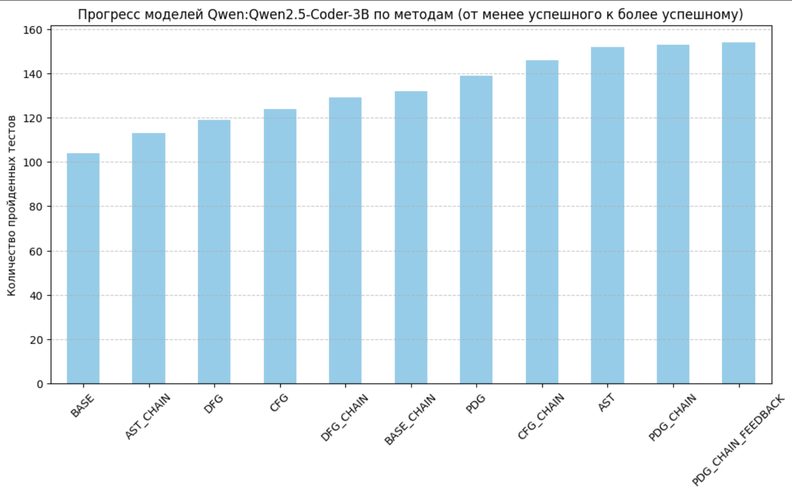
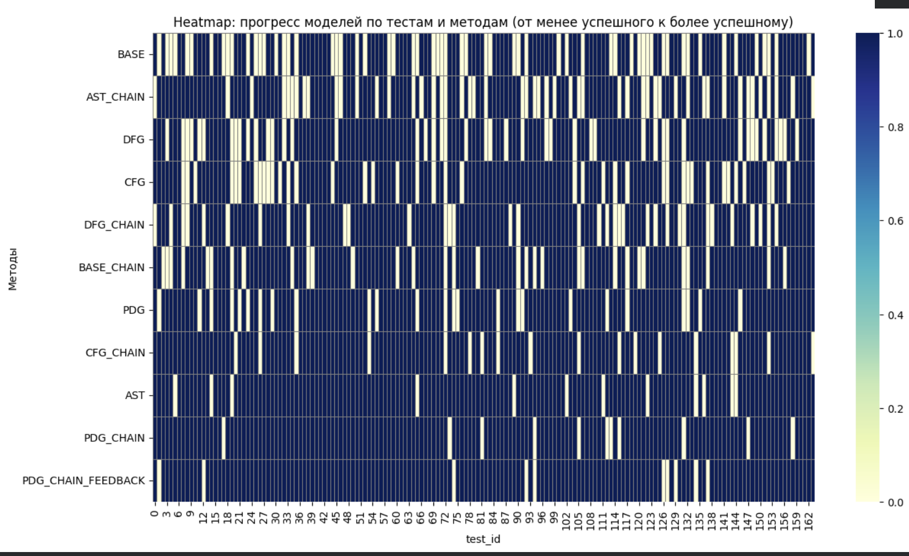
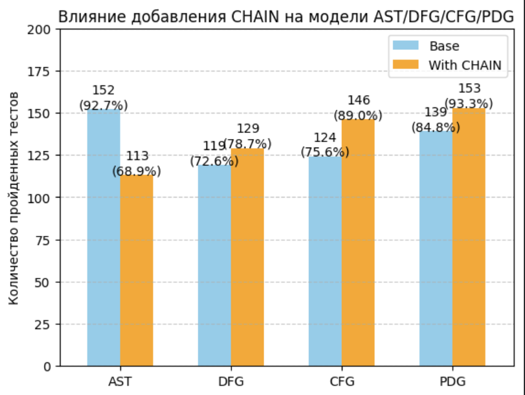

# Проект бенчмарков LLM

Н хорошо структурированный Python проект для бенчмаркинга генерации кода моделями LLM, с фокусом на модульности, правильном разделении задач и расширяемости.

## Структура проекта

```
├── src/                    # Исходные модули
│   ├── utils/             # Утилиты (обработка кода, окружение)
│   ├── models/            # Загрузка моделей и генерация кода
│   ├── data/              # Загрузка и обработка датасетов
│   ├── benchmarks/        # Запуск бенчмарков
│   ├── evalution/         # Запуск тестов и метрики
│   └── config/            # Управление конфигурацией
├── configs/               # YAML файлы конфигурации
├── Fine‑tuning/           # Ноутбуки и скрипты для дообучения моделей
│   ├── AST/               # Дообучение на основе AST (Abstract Syntax Tree)
│   ├── CFG/               # Дообучение на основе CFG (Control Flow Graph)
│   ├── DFG/               # Дообучение на основе DFG (Data Flow Graph)
│   └── PDG/               # Дообучение на основе PDG (Program Dependency Graph)
├── main.py                # Основной файл входа
├── run_demo.py            # Демонстрационный скрипт
├── test_cli.py            # Тест CLI парсинга
├── test_cli_new.py        # Тест новых флагов CLI
├── README.md              # Документация проекта
├── requirements.txt       # Зависимости Python
└── .gitignore            # Игнорируемые файлы Git
```

## Возможности

- **Модульная архитектура**
- **Поддержка LoRA адаптеров**
- **Комплексный бенчмаркинг**
- **Итеративное самокорректирование (AgentChain)**
- **Управление конфигурацией**
- **Детальное отслеживание результатов**

## Fine-tuning моделей

Проект включает ноутбуки и скрипты для дообучения моделей на различных программных графах:

- **AST (Abstract Syntax Tree)**: Дообучение на основе абстрактного синтаксического дерева
- **CFG (Control Flow Graph)**: Дообучение на основе графа потока управления
- **DFG (Data Flow Graph)**: Дообучение на основе графа потока данных
- **PDG (Program Dependency Graph)**: Дообучение на основе графа зависимостей программы

### Запуск fine-tuning

```bash
# Для PDG с обратной связью
cd Fine‑tuning/PDG
python train_feedback_PDG.py
```

Ноутбуки Jupyter (.ipynb) содержат примеры процессов дообучения для каждого типа графа.

## Результаты исследования

Проект включает подробное исследование эффективности различных подходов к fine-tuning моделей Qwen2.5-Coder-3B на датасете HumanEval. Результаты тестирования на 164 задачах показывают значительное улучшение производительности при использовании специализированных методов обучения.

### Ключевые результаты

| Метод | Результат | Улучшение |
|-------|-----------|-----------|
| **PDG_CHAIN_FEEDBACK** | **154/164 (93.9%)** | **+30.5 п.п.** |
| PDG_CHAIN | 153/164 (93.3%) | +30.1 п.п. |
| AST | 152/164 (92.7%) | +29.3 п.п. |
| CFG_CHAIN | 146/164 (89.0%) | +25.6 п.п. |
| PDG | 139/164 (84.8%) | +21.4 п.п. |
| CFG | 124/164 (75.6%) | +12.2 п.п. |
| DFG | 119/164 (72.6%) | +9.2 п.п. |
| BASE_CHAIN | 132/164 (80.5%) | +17.1 п.п. |
| **BASE** | **104/164 (63.4%)** | *базовый уровень* |

### Влияние итеративного самокорректирования (CHAIN)

CHAIN технология в большинстве случаев повышает эффективность методов, однако эффект может варьироваться:

- **AST**: 92.7% → AST_CHAIN: 68.9% (**ухудшение на -23.8 п.п.**)
- **DFG**: 72.6% → DFG_CHAIN: 78.7% (**+6.1 п.п.**)
- **CFG**: 75.6% → CFG_CHAIN: 89.0% (**+13.4 п.п.**)
- **PDG**: 84.8% → PDG_CHAIN: 93.3% (**+8.5 п.п.**)

Обратная связь (FEEDBACK) дает дополнительное улучшение: PDG_CHAIN_FEEDBACK достигает **93.9%**.

*Примечание: В случае AST метод CHAIN ухудшил результаты, что может указывать на необходимость оптимизации комбинации AST + CHAIN.*

### Визуализации результатов

Проект включает детальные визуализации прогресса моделей:

1. **Диаграмма прогресса**: Столбчатая диаграмма показывающая количество пройденных тестов для каждого метода, отсортированная от менее успешных к более успешным подходам.

2. **Тепловая карта**: Полный обзор прохождения всех 164 тестов каждым методом, позволяющий выявить паттерны успешности и проблемные области.

3. **Сравнительный анализ**: Диаграмма демонстрирующая влияние добавления CHAIN технологии на базовые методы AST/DFG/CFG/PDG.

Подробные результаты и графики доступны в файле `RESEARCH_RESULTS.ipynb`.

## Использование

### Базовое использование

```bash
# Запуск бенчмарка с конфигурацией по умолчанию
python main.py

# Запуск с пользовательскими аргументами
python main.py --model-path путь/к/модели --limit 10

# Запуск без AgentChain (один проход генерации)
python main.py --model-path путь/к/модели --no-use-agent-chain

# Использовать только базовую модель без дообученных адаптеров
python main.py --base-model-path путь/к/базовой/модели --use-base-model-only

# Использование файла конфигурации
python main.py --config configs/example_config.yaml
```

## Конфигурация

### Переменные окружения (.env)

```env
KEY_HUGGINGFACE=hf_ваш_ключ_huggingface
MAIN_MODEL_PATH=pdg_trained_github
BASE_MODEL_PATH=Qwen/Qwen2.5-Coder-3B
```

## Аргументы командной строки

```
Конфигурация модели:
  --model-path PATH      Путь к модели
  --base-model-path PATH Путь к базовой модели
  --device CHOICE        Устройство для использования (auto, cuda, cpu)

Конфигурация бенчмарка:
  --limit INT            Ограничить количество примеров
  --iterations INT       Количество итераций самокорректирования
  --output-file FILE     Файл вывода результатов
  --verbose              Подробный вывод
  --no-use-agent-chain   Отключить AgentChain для итеративного исправления кода
  --use-base-model-only  Использовать только базовую модель без дообученных адаптеров
```

## Требования

- Python 3.8+
- PyTorch 2.0+
- transformers>=4.30.0
- datasets>=2.12.0
- peft>=0.4.0
- huggingface_hub>=0.14.0
- accelerate>=0.20.0
- PyYAML>=6.0
- tqdm>=4.64.0
- numpy>=1.24.0
- scikit-learn>=1.3.0

Установка:
```bash
pip install -r requirements.txt
```

## Возможности бенчмарка

### Бенчмарк HumanEval

Бенчмарк HumanEval оценивает способность модели решать задачи программирования на Python. Он измеряет метрику Pass@k, где k указывает на количество попыток, которые получает модель.

Основные возможности:
- Поддержка итеративного самокорректирования
- Проверка синтаксиса и выполнения
- Детальная обработка ошибок
- Несколько метрик помимо Pass@1

### Возможности генерации кода

- Автоматическая промпт-инженерия
- Обнаружение ошибок и самокорректирование
- Безопасное выполнение в изолированных средах
- Несколько стратегий генерации

## Детали архитектуры

### Модуль utils

- `environment.py`: Конфигурация окружения и управление устройством
- `code_utils.py`: Обработка кода, валидация и манипуляции

### Модуль models

- `model_loader.py`: Загрузка моделей с поддержкой адаптеров LoRA и квантизации
- `code_generator.py`: Генерация кода с итеративным самокорректированием

### Модуль data

- `dataset_loader.py`: Загрузка датасетов, таких как HumanEval и MBPP

### Модуль benchmarks

- `humaneval_benchmark.py`: Запуск бенчмарка HumanEval
- `benchmark_manager.py`: Менеджер для координации бенчмарков

### Модуль evalution

- `test_runner.py`: Запуск тестов в изолированных средах
- `evaluation_metrics.py`: Метрики для оценки, включая Pass@k

### Модуль config

- `config_manager.py`: Управление конфигурацией с поддержкой CLI и YAML

## Русификация проекта

Все сообщения логирования, комментарии в коде и выводы переведены на русский язык. Это включает:

- Весь вывод в консоль на русском языке
- Docstrings и комментарии в коде
- Сообщения об ошибках
- Справочные сообщения


## Устранение неполадок

- Убедитесь, что у вас достаточно видеопамяти для вашей модели
- Для больших моделей рассмотрите использование квантизации
- При ошибках памяти попробуйте уменьшить `--limit` 
- Для отладки используйте флаг `--verbose` для более детального вывода

## Дополнительные файлы

### Демонстрационные и тестовые скрипты

- `run_demo.py`: Демонстрационный скрипт с русифицированными сообщениями
- `test_cli.py`: Тест парсинга аргументов командной строки
- `test_cli_new.py`: Тест новых флагов CLI (use_base_model_only, no_use_agent_chain)

### Исследовательские материалы

- `RESEARCH_RESULTS.ipynb`: Ноутбук с анализом результатов тестирования различных методов fine-tuning, включая статистику, визуализации и сравнительный анализ эффективности подходов





### Fine-tuning материалы

- `Fine‑tuning/AST/AST.ipynb`: Ноутбук для дообучения на AST
- `Fine‑tuning/CFG/CFG.ipynb`: Ноутбук для дообучения на CFG
- `Fine‑tuning/DFG/DFG.ipynb`: Ноутбук для дообучения на DFG
- `Fine‑tuning/PDG/PDG.ipynb`: Ноутбук для дообучения на PDG
- `Fine‑tuning/PDG/train_feedback_PDG.py`: Скрипт для дообучения PDG с обратной связью
